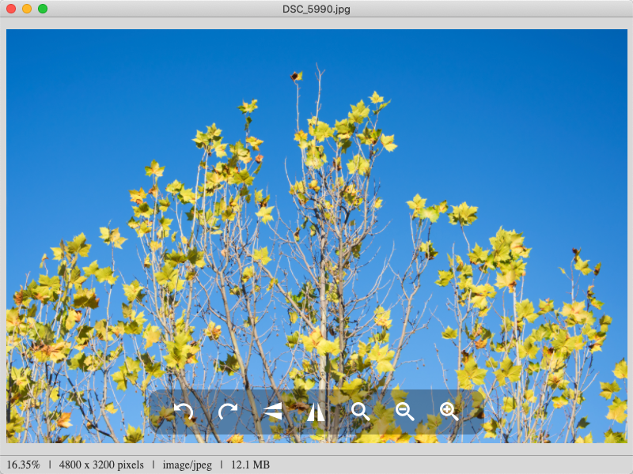

  

# Ant Preview

A simple image preview with the below formats supported at present.

* jpg
* png
* gif
* bmp
* webp
* svg

  

## Tech stack

* Electron
* electron-forge
* webpack
* vue3
* TypeScript

## About logo

* An ant icon in [Pets Animals icon set](https://www.iconfinder.com/iconsets/pets-animals-2) created by [Webalys](https://www.iconfinder.com/webalys).
* Using a [superellipse](https://en.wikipedia.org/wiki/Superellipse) shape (`|x|^3+|y|^3=1`) is inspired by [New Xiaomi's logo](https://blog.mi.com/en/2021/03/30/xiaomi-unveils-new-alive-branding-identity/) and the svg path is sourced from [yisibl](https://github.com/yisibl). [original file url](http://img.alicdn.com/imgextra/i4/O1CN01AA77Pz1oSBJzbVOm0_!!6000000005223-55-tps-192-192.svg).
* Images are converted by [cloudconvert](https://cloudconvert.com/). [SVG to PNG Converter](https://cloudconvert.com/svg-to-png) and [PNG to ICNS Converter](https://cloudconvert.com/png-to-icns).

## Todos

### Core features

* [x] ~~Try to use svg transform~~. Not work! Using nextTick could figure out blink when scaling the image.
* [x] Support dragging file
* [x] Show exif information
* [x] Dark theme
* [x] Internationalization
* [ ] Movable toolbar
* [x] Print
* [ ] Help document
* [ ] Multiple files
* [ ] Recent files
* [ ] Support using mouse wheel to zoom
* [ ] Support using drag to move

### Advanced features

* [ ] Preference setting
* [ ] Minimap
* [ ] Magnifier
* [ ] Fullscreen mode
* [ ] Slideshow mode

### Engineering

* [ ] E2E testing
* [x] Auto packaging
* [ ] Performance testing and improving
* [ ] Accessibility
* [ ] Security

### More image formats

* [ ] PDF
* [ ] Sketch
* [ ] Figma
* [ ] PSD
* [ ] TIFF
* [ ] RAW

## License

Apache License 2.0
